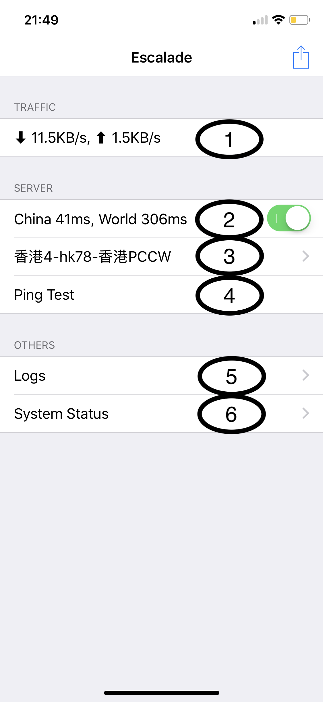

# Escalade User Guide
Escalade for iOS是一款用于科学上网的App，主要智能路由和一键切换最快节点的功能。下面是App界面的截图：

## 基本使用
- 第二项右边的Switch是总开关。
- 第二项左边是当前网络质量，点击一下会重新测试当前网络的质量。其中
    - `China`表示直连国内`google.cn`所需要的时间，
    - `World`表示通过`当前设置的代理节点`连接国外`google.com`的时间,
- 第三项是`当前设置的代理节点`，点击进入查看所有的节点。
- 点击第四项会测试所有的代理节点，找到连接最快的节点设置成当前节点，同时`World`会显示最新的连接时间。当国际网络比较慢的时候，需要用到这个功能。

## 高级使用
- 第一项是系统当前的总的数据上传下载速度，点击进入可以查看当前活跃的网络连接信息
- 第五项Logs, 点击查看App的log信息，主要用来分析App的问题的
- 第六项System Status， 点击查看EscaladeApp和系统当前的cpu和内存使用情况

## 其他事项
- App本身除了在Logs里面有一些基本的用于调试的信息，不记录数据连接信息. 并且Logs不会自动上传到任何服务器，只有Escalade使用者可以将Logs发送给开发者或其他人
- App具有智能路由功能，采用了针对国内优化的代理策略，国内网站直接连接，国外网站通过代理连接，故开启Escalade VPN后，不影响国内网站的访问速度，故可以长期开启
- App使用遇到什么问题，或者有任何想法和建议，请联系开发者，帮助开发者一起完善这个App :)
